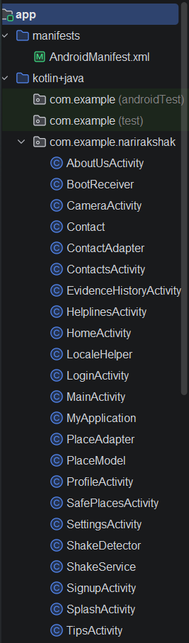
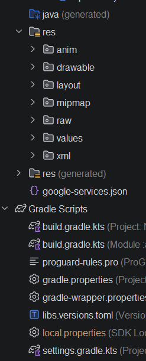

# NariRakshak – Women's Safety Android Application

NariRakshak is a women's safety Android application designed to provide quick emergency assistance and enhance personal safety through smart emergency features. The application enables users to send SOS alerts, share live location, manage emergency contacts, access nearby emergency services, and securely maintain safety-related evidence, all within a user-friendly interface.

## Features

- User Registration and Login using Firebase Authentication
- One-Tap SOS Alert
- Shake Detection to Trigger SOS
- Live GPS Location Tracking
- Emergency Contact Management
- SMS Alerts with Live Location
- Silent Image Capture for Evidence Collection
- Evidence History
- Nearby Police Stations and Hospitals with Google Maps Navigation
- Emergency Helpline Numbers
- Self-Defense Tips and Safety Videos
- User Feedback System
- Hindi and English Language Support

## Technologies Used

- Android development
- Java
- Android Studio
- XML
- Firebase Authentication
- Cloud Firestore
- Google Maps API
- Fused Location Provider API
- GPS
- ImgBB API
- SmsManager
- SensorManager (Accelerometer)
- SharedPreferences
- Firebase Realtime Database
- Android SDK
- Gradle Build System

## Screenshots

The application includes the following interfaces:

<h3>Login Screen</h3>

  

<h3>Sign In</h3>

  

<h3>Home Dashboard</h3>

  

<h3>Emergency Helpline</h3>

  

<h3>Capture Photo</h3>

  

<h3>Emergency Contacts</h3>

  

<h3>Profile</h3>

  

<h3>Settings</h3>

  

<h3>Safety Tips</h3>

  

<h3>Safety Videos</h3>

  

<h3>Map</h3>

  

<h3>Evidence History</h3>

  

<h3>Feedback</h3>

  

## Project Demonstration

- APK Download: https://drive.google.com/file/d/1fEgGlYrFOypieCokkXF2pgn_SNLus2J-/view?usp=drive_link
- Demo Video: https://drive.google.com/file/d/16fvsg-u9fcrQnRNREn6B1ImmG9nYQwj0/view?usp=drive_link
- Source Code: Available in this GitHub repository

## Project Structure

**App Architecture & Classes**

**Resources & Gradle Files**

## Future Enhancements

- AI-Based Risk Detection using Machine Learning for activity and behavior analysis
- Voice-Activated SOS using speech recognition
- Smart Fall Detection for automatic emergency alerts
- Emergency Audio and Video Recording with secure cloud backup
- Push Notifications for emergency contacts
- Offline Emergency Mode for limited network connectivity
- Wearable Device Integration (Smartwatch/Band Support)
- Real-Time Emergency Monitoring Dashboard for administrators
- Route Safety Analysis to suggest safer travel paths
- Nearby Safe Shelter and Emergency Service Recommendations
- One-Tap Audio/Video Call with Emergency Contacts
- SOS Notification through Internet (Push Notification) in addition to SMS

## Author

**Nandani Prajapat**

Computer Science Diploma Graduate

Android Developer | Web Developer | Java | Firebase

LinkedIn: https://www.linkedin.com/in/nandani-prajapat-3124462a3/?skipRedirect=true

